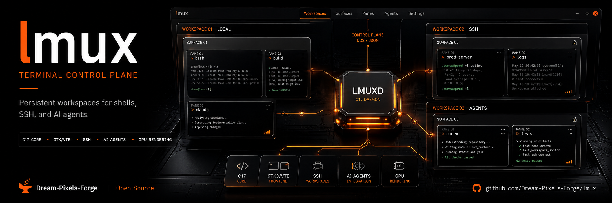

<p align="center">
  
</p>

<h1 align="center">lmux</h1>

<p align="center">
  <strong>Terminal multiplexer for AI coding agents — Linux-native, enterprise-grade</strong>
</p>

<p align="center">
  <a href="https://github.com/Dream-Pixels-Forge/lmux/releases/tag/v1.0.0-beta.1"></a>
  
  
  
</p>

---

## What is lmux?

lmux is a modern terminal multiplexer designed for running multiple AI coding agents in parallel. It combines a **C17 core daemon** with a **GTK3/VTE GUI**, communicating over Unix domain sockets with a JSON wire protocol.

**Key advantages:**
- **Linux-native** — cross-platform C core (cmux is macOS-only)
- **Enterprise security** — path traversal prevention, rate limiting, TOCTOU protection
- **Agent-optimized** — hibernation, teams, cloud VMs, clipboard history
- **Tmux-compatible** — familiar commands work out of the box
- **Embeddable** — `liblmux_core.a` static library

---

## Architecture

```
┌──────────────────────────────────────────────────────┐
│  lmux (CLI)              lmux-gui (Python GTK3/VTE)  │
│  C binary                 GUI frontend               │
└────────┬───────────────────────────┬─────────────────┘
         │ Unix domain socket (JSON) │
         ▼                           ▼
┌──────────────────────────────────────────────────────┐
│  lmuxd — Core Daemon                                 │
│  liblmux_core.a (C17 static library)                 │
│    ├── model.c   — workspace/surface/pane lifecycle  │
│    ├── server.c  — UDS JSON server + auth            │
│    ├── config.c  — configuration loader              │
│    └── osc.c     — OSC notification parser           │
└──────────────────────────────────────────────────────┘
```

### Workspace Model

```
lmuxd
 ├── Workspace 1
 │    ├── Surface 1 (tab)
 │    │    ├── Pane 1  ← terminal
 │    │    └── Pane 2  ← terminal (split)
 │    └── Surface 2
 │         └── Pane 1
 ├── Workspace 2 (SSH)
 │    └── Surface 1
 │         └── Pane 1
 └── ...
```

- **Workspace** — named collection of surfaces
- **Surface** — tab within a workspace, containing one or more panes
- **Pane** — terminal session (local shell or SSH)

---

## Quick Start

### Build from source

```bash
# Install dependencies (Debian/Ubuntu)
sudo apt install build-essential python3 python3-gi gir1.2-vte-2.91 nodejs

# Build everything
node scripts/run.mjs
```

### CLI usage

```bash
# Start daemon
./build/lmux daemon --detach

# Create a workspace
./build/lmux workspace create --name "my-project"

# List workspaces
./build/lmux workspace list

# Show all commands
./build/lmux help
```

### GUI usage

```bash
# Requires GTK3 + VTE
python3 gui/main.py
```

### Install (Debian/Ubuntu)

```bash
# Build + install in one step
make install-deb

# Or build AppImage
./packaging/build-appimage.sh
```

---

## Features

### Core

| Feature | Commands |
|---------|----------|
| **Workspace management** | `workspace.create`, `workspace.list`, `workspace.close`, `workspace.select`, `workspace.rename` |
| **Surface (tabs)** | `surface.create`, `surface.list`, `surface.close`, `surface.focus` |
| **Pane splits** | `surface.split`, `pane.focus`, `pane.close` |
| **Multi-window** | `window.create`, `window.list`, `window.close`, `window.focus`, `window.move_workspace` |

### Agent Features

| Feature | Commands |
|---------|----------|
| **Agent hibernation** | Auto-hibernate after 300s idle; `agent.hibernate`, `agent.resume`, `agent.list` |
| **Agent teams** | `team.create`, `team.add`, `team.remove`, `team.list`, `team.dispatch`, `team.delete` |
| **Cloud VMs** | `cloud_vm.list`, `cloud_vm.create`, `cloud_vm.destroy`, `cloud_vm.ssh` |
| **iOS companion** | `ios.register`, `ios.status`, `ios.notify`, `ios.unregister` |

### Productivity

| Feature | Commands |
|---------|----------|
| **Tmux compatibility** | `tmux.new-session`, `tmux.split-window`, `tmux.select-pane`, `tmux.send-keys`, etc. |
| **Copy mode (vi)** | `pane.copy_mode.enter/exit`, `h/j/k/l/w/b/0/$/gg/G`, `select_start/end`, `yank`, `paste` |
| **File explorer** | `file_explorer.open/list/navigate/filter/sort/create_dir/delete/rename/search` |
| **Canvas layout** | `canvas.enable/disable/move_pane/resize_pane/set_z/get_layout/set_layout` |
| **Find in terminal** | `search.start`, `search.next`, `search.prev`, `search.cancel`, `search.status` |
| **Clipboard history** | `clipboard.copy`, `clipboard.paste`, `clipboard.list`, `clipboard.clear` |
| **Workspace templates** | `template.list`, `template.create`, `template.save`, `template.delete` |

### Information Panels

| Feature | Commands |
|---------|----------|
| **Feed panel** | `feed.create`, `feed.list`, `feed.close`, `feed.entry_add/list` |
| **Calendar** | `calendar.import`, `calendar.today`, `calendar.upcoming` |
| **Email** | `email.import`, `email.list`, `email.search` |
| **Weather** | `weather.get`, `weather.set_location`, `weather.refresh` |
| **Performance profiling** | `profile.status`, `profile.start`, `profile.stop`, `profile.list` |

### Notifications

| Feature | Commands |
|---------|----------|
| **OSC notifications** | Automatic terminal bell detection |
| **Visual rings** | `notification_ring.add`, `notification_ring.clear` |
| **Event hooks** | `notification_hook.add` — trigger commands on events |

---

## Security

lmux applies defense-in-depth hardening:

| Measure | Description |
|---------|-------------|
| **Socket authentication** | `SO_PEERCRED` UID verification — only owner can connect |
| **Socket permissions** | `chmod(0600)` — owner-only access |
| **Rate limiting** | 1000 req/60s per UID, fail-closed on table full |
| **Path traversal prevention** | All file paths validated against `..` sequences |
| **TOCTOU protection** | Bind-first pattern with stale socket detection |
| **Input validation** | JSON structure validated before dispatch |
| **Structured errors** | RFC 7807 format, no stack traces leaked |
| **CWD validation** | Shell injection prevention in workspace refresh |
| **Atomic writes** | Config files use write-to-temp + rename |
| **Structured logging** | JSON logging via `LMUX_LOG_JSON=1` |

See [SECURITY.md](SECURITY.md) for the full security policy.

---

## Configuration

lmux reads configuration from `~/.config/lmux/config.json`:

```json
{
  "font_family": "Fira Code",
  "font_size": 14,
  "theme": "dark",
  "default_shell": "/bin/zsh",
  "auto_save_session": true,
  "groups": {
    "dev": ["workspace-1", "workspace-2"],
    "ops": ["workspace-3"]
  },
  "keybindings": {
    "split-v": "C-b %",
    "split-h": "C-b \""
  }
}
```

| Key | Type | Default | Description |
|-----|------|---------|-------------|
| `font_family` | string | `monospace` | Terminal font |
| `font_size` | int | `12` | Font size |
| `theme` | string | `"dark"` | `"dark"` or `"light"` |
| `default_shell` | string | system `$SHELL` | Shell for new panes |
| `auto_save_session` | bool | `true` | Auto-save/restore sessions |

---

## CLI Commands

| Command | Description |
|---------|-------------|
| `version` | Print version |
| `help` | Show available commands |
| `daemon` | Run in daemon mode |
| `daemon --detach` | Run daemon in background |
| `workspace list` | List all workspaces |
| `workspace create [--name <name>]` | Create workspace |
| `workspace close <id>` | Close workspace |
| `workspace select <id>` | Switch to workspace |
| `workspace rename <id> <name>` | Rename workspace |
| `surface create <workspace_id>` | Create surface (tab) |
| `surface split <ws_id> <surf_id> [h\|v]` | Split pane |
| `pane.create` | Create pane |
| `notification list` | List notifications |
| `notification clear` | Clear all |

---

## GUI Keyboard Shortcuts

| Shortcut | Action |
|----------|--------|
| `Ctrl+Shift+T` | New surface (tab) |
| `Ctrl+Shift+W` | Close surface |
| `Ctrl+Shift+-` | Split pane vertical |
| `Ctrl+Shift+=` | Split pane horizontal |
| `Ctrl+Shift+N` | New workspace |
| `Ctrl+Shift+Q` | Quit |
| `Ctrl+Shift+Arrow` | Focus prev/next pane |

---

## GPU Rendering (Experimental)

lmux has an experimental GTK4 frontend with GPU-accelerated rendering:

```bash
# Auto-detect GPU backend
./scripts/launch-gtk4.sh

# Force specific renderer
GSK_RENDERER=opengl python3 gui/gtk4/main.py
GSK_RENDERER=vulkan python3 gui/gtk4/main.py
```

| Feature | GTK3 | GTK4 |
|---------|------|------|
| Rendering | CPU (Cairo) | GPU (OpenGL/Vulkan) |
| Compositing | Window manager | Built-in |
| Animations | Manual | Automatic (GSK) |

---

## Testing

```bash
# Run all tests
make test

# Run C unit tests only
node scripts/test.mjs --unit

# Run integration tests only
python3 tests/test_integration.py -v

# Run fuzz tests
./tests/fuzz_json

# Run benchmarks
python3 tests/benchmarks.py
```

**Test results:**
- 217 integration tests (Python)
- 37 C unit tests
- 20K+ fuzz iterations
- Performance benchmarks (p99 < 50ms)

---

## Comparison with cmux

| Feature | cmux | lmux |
|---------|------|------|
| **Platform** | macOS only | Linux (cross-platform core) |
| **Core** | Swift/Ghostty | C17 static library |
| **Security** | Basic auth | Rate limiting, path traversal, TOCTOU |
| **Agent teams** | No | Yes (create/add/dispatch/delete) |
| **Cloud VMs** | No | Yes (list/create/destroy/ssh) |
| **Clipboard history** | No | Yes |
| **Workspace templates** | No | Yes |
| **Performance profiling** | No | Yes |
| **Tmux compat** | Partial | Full (10 commands) |
| **Tests** | ~100 | 217+ |
| **Supply chain** | None | SBOM + signing + Trivy |

See [dev-notes/COMPARISON.md](dev-notes/COMPARISON.md) for detailed analysis.

---

## Packaging

### Debian/Ubuntu

```bash
make install-deb
# Produces: dist/deb/lmux_<version>_amd64.deb
```

### AppImage

```bash
./packaging/build-appimage.sh
# Produces: build/lmux-<version>-x86_64.AppImage
```

### Static binary

```bash
# Build with musl for fully static binary
node scripts/build-cli.mjs --static
```

See [DEVELOPMENT.md](DEVELOPMENT.md) for build instructions, test commands, and architecture details.

---

## Contributing

1. Fork the repository
2. Create a feature branch (`git checkout -b feat/my-feature`)
3. Commit changes (`git commit -m 'feat: add my feature'`)
4. Push to branch (`git push origin feat/my-feature`)
5. Open a Pull Request

All changes must pass the full test suite (`make test`) before merge.

---

## License

MIT — see [LICENSE](LICENSE)
